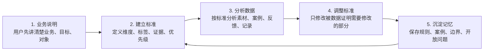
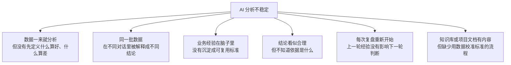
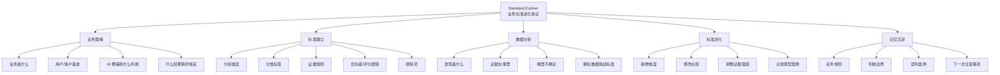
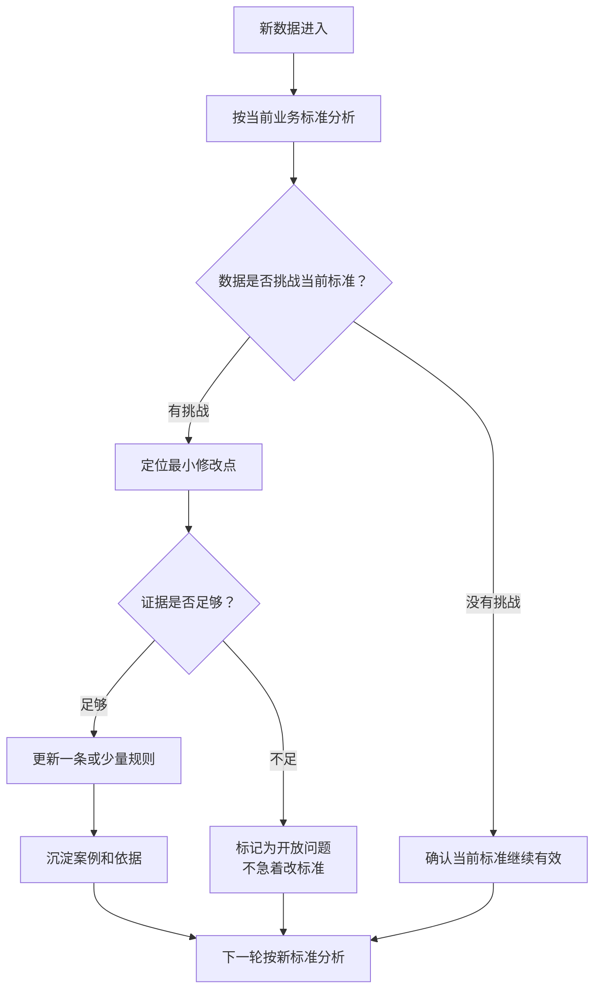

# Standard Evolver

让 AI 先理解业务，再用数据持续进化业务判断标准的通用 Skill。

Standard Evolver 不是一个复杂系统，也不绑定任何具体应用形态。它是一套轻量工作协议：先让用户说清楚自己的业务，再帮助用户建立一套业务分析标准，之后每次拿到新数据，都用数据去校准这套标准，并把新的判断规则沉淀下来。

一句话概括：

```text
先建立业务标准，再让每一次数据分析成为下一次标准进化的证据。
```

## 一张图看懂



真正重要的不是展示形式，而是业务标准会随着数据不断变清楚。

## 它解决什么问题

很多 AI 分析的问题不是模型不会分析，而是缺少稳定的业务标准。



Standard Evolver 的目标是把隐性的业务判断显性化，让 AI 的分析不只是“给结论”，而是逐步形成一套可复用、可解释、可迭代的业务标准。

## 功能地图



## 标准怎么进化



核心原则：不要因为一批数据就重写整套标准。每次只改必要的一小部分，方便验证到底是哪条规则让判断变好了。

## 三种使用模式

| 模式 | 适合什么时候用 | 产出 |
| --- | --- | --- |
| 初始化模式 | 第一次使用，还没有业务标准 | 第一版业务标准 |
| 分析模式 | 已有标准，需要分析新数据 | 基于标准的数据分析 |
| 进化模式 | 分析后发现标准需要更新 | 标准更新记录和沉淀记忆 |

### 初始化模式

```text
用 standard-evolver 帮我先梳理业务，并建立第一版业务分析标准。

我的业务是：
用户/客户是：
我希望 AI 帮我判断：
什么结果算好：
什么结果算差：
```

### 分析模式

```text
用 standard-evolver 按当前业务标准分析下面这批数据。

当前标准是：
新数据是：
我希望得到的输出是：
```

### 进化模式

```text
用 standard-evolver 判断这批数据是否需要更新当前标准。

如果需要，只修改被数据证明需要修改的部分，并说明依据。
```

## 推荐输入格式

你不需要一开始就准备得很完整，但越清楚越好。

```text
业务背景：
目标用户：
我想让 AI 判断的问题：
什么结果算好：
什么结果算差：
已有标准：
这次要分析的数据：
希望输出形式：
```

如果你还没有已有标准，可以留空，让 Standard Evolver 先帮你建立第一版。

## 输出结构


一次完整输出通常包含：

- Business Context：业务背景
- Business Standard：当前业务标准
- Data Analysis：基于标准的数据分析
- Standard Update：标准更新记录
- Memory Deposit：可复用记忆沉淀

## 使用示例

假设你在做产品机会分析。

用户提供了一批评论，里面很多人说“这个东西不错”“我喜欢这个功能”。普通 AI 可能直接总结为“用户需求强烈”。但 Standard Evolver 会先建立业务标准：偏好信号和付费信号要分开。

它会这样分析：

- “喜欢”是弱信号，只说明兴趣或情绪倾向。
- “搜索替代方案”“询价”“购买”“投诉现有方案”“招聘相关岗位”是更强信号。
- 如果只有喜欢，没有行动证据，就不能直接判断为强需求。

最后沉淀一条新规则：

```text
在产品机会分析中，不要把喜欢直接等同于付费意愿。必须检查是否存在行动型需求信号。
```

这就是标准进化：不是多写一段总结，而是让下一次判断更稳。

## 优点在哪里

| 优点 | 说明 |
| --- | --- |
| 更稳定 | 先有标准再分析，减少同一类数据被反复解释成不同结论。 |
| 更可解释 | 每个判断都能追溯到业务标准和数据证据。 |
| 可沉淀 | 每次分析都会留下可复用的规则、案例和边界。 |
| 小步进化 | 每次只调整一小部分标准，避免被单次数据带偏。 |
| 不绑定工具 | 可以用于 Codex Skill、普通提示词、项目文档、知识库、业务系统或任何 AI 工作流。 |
| 适合长期沉淀 | 可以帮助业务系统明确哪些信息有价值、哪些关系只是弱信号、哪些判断需要强证据。 |

## 使用建议

- 先从一个具体业务目标开始，不要一开始就覆盖所有场景。
- 第一版标准可以粗糙，但必须能指导下一次分析。
- 每次只改一条或少量规则，方便验证效果。
- 把典型案例沉淀下来，案例比抽象原则更容易复用。
- 区分事实、解释和猜测，不要把临时判断写成确定规则。
- 数据不足时标记“不确定”，不要强行进化标准。
- 不要一开始就做复杂数据库、看板或自动化流程，先让标准循环跑通。
- 如果要公开分享案例，记得去掉隐私、客户名和敏感业务信息。

## 不适合什么

Standard Evolver 不适合用来：

- 直接替代行业专家判断
- 把所有原始资料原封不动存起来
- 一次性生成完整商业策略
- 在没有业务目标的情况下泛泛总结资料
- 没有验证就把猜测固化成标准

它更适合做“业务标准的持续校准层”。

## 仓库内容

- [`SKILL.md`](./SKILL.md)：Codex Skill 的核心指令。
- [`agents/openai.yaml`](./agents/openai.yaml)：Skill 的展示信息和默认提示。
- [`docs/standard-evolver-public-story.md`](./docs/standard-evolver-public-story.md)：对外分享稿，解释这套方法的由来和思路。

## 交流与反馈

如果你对这套方法有想法、改进建议或自己的实验案例，可以联系：`jiangzi4560`
